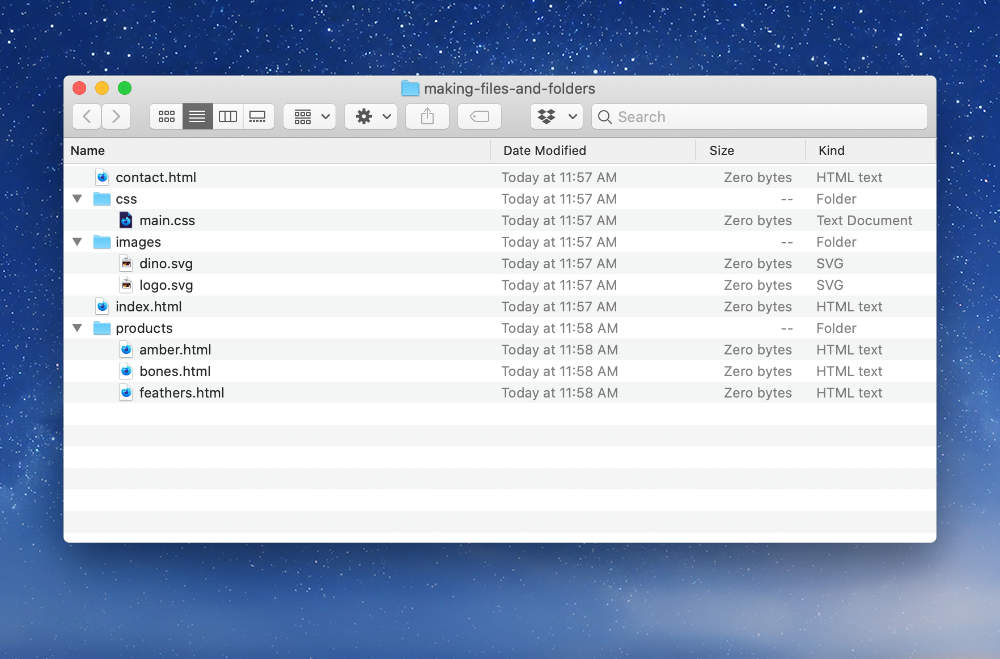

# Making files & folders

## Overview

- Using the image below as references, re-create the folders & files.
- You can make the folder anywhere you want on your computer, but a `web-design-1` folder is best.
- **All the files can remain completely empty—they just have to exist.**
- You can make folders in Finder or in your code editor.
- You will need to create all the files in your code editor.

---

## Details

- **Recreate this folder structure on your own computer.**
- **All the files can remain completely empty—they just have to exist.**

---

## Hand in

Show your teacher the completed folder.
